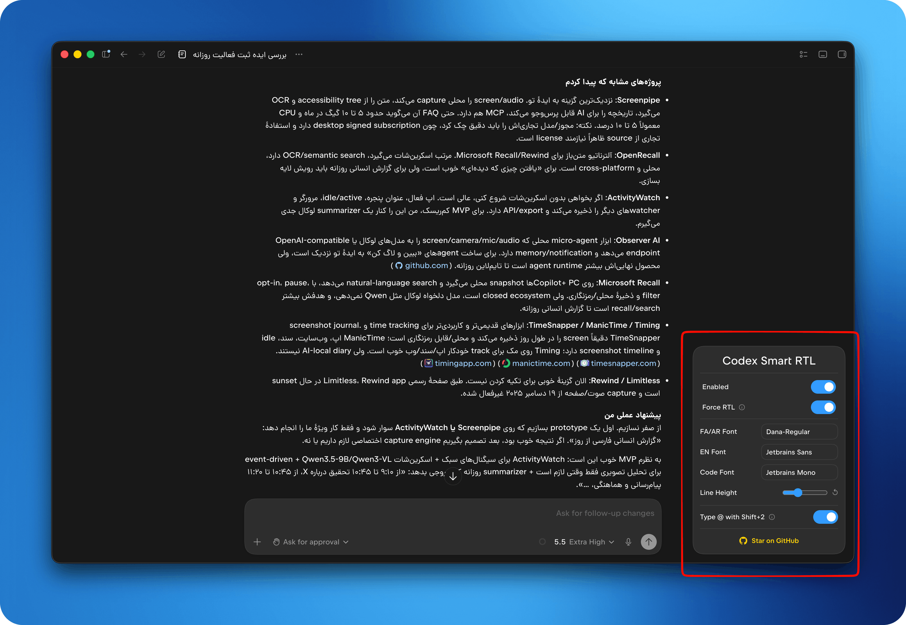

# Codex RTL Plus

پشتیبانی هوشمند راست‌به‌چپ برای اپ دسکتاپ ChatGPT/Codex؛ با تمرکز روی متن‌های فارسی، عربی، عبری و محتوای ترکیبی RTL/LTR.



Codex RTL Plus فایل Electron برنامه را به‌صورت محلی patch می‌کند و یک موتور تشخیص جهت به رابط گفتگو اضافه می‌کند. متن مکالمه و باکس نوشتن پرامپت بر اساس محتوای واقعی تنظیم می‌شوند، درحالی‌که کد، فرمول، ترمینال و بخش‌های اصلی رابط کاربری LTR باقی می‌مانند.

## چه چیزهایی اصلاح می‌شوند؟

- تشخیص متن فارسی/عربی حتی وقتی جمله با واژهٔ انگلیسی شروع شود
- نمایش صحیح جمله‌های ترکیبی مانند `Codex می‌تواند این File را دوباره بررسی کند`
- تشخیص زندهٔ جهت در باکس پرامپت هنگام تایپ و Paste
- پشتیبانی از متن‌های چندخطی ترکیبی
- جداسازی کد، LaTeX و عبارت‌های محاسباتی به‌صورت LTR
- جهت‌دهی مناسب جدول‌های فارسی و عربی
- فونت جداگانه برای فارسی/عربی، انگلیسی، کد و ترمینال
- اصلاح `Shift + 2` برای تایپ `@` با چیدمان صفحه‌کلید فارسی

## پنل تنظیمات

پس از نصب، دکمهٔ شناور **Codex Smart RTL** در برنامه نمایش داده می‌شود. گزینه‌های اصلی پنل:

| گزینه | کاربرد |
| --- | --- |
| Enabled | فعال یا غیرفعال‌کردن کامل موتور RTL |
| Force RTL | اجبار جهت RTL برای محتوای گفتگو |
| Prompt RTL | تشخیص زندهٔ جهت در باکس نوشتن پرامپت |
| FA/AR Font | فونت فارسی و عربی |
| EN Font | فونت متن لاتین |
| Code Font | فونت کد و ترمینال |
| Line Height | فاصلهٔ خطوط |
| Type @ with Shift+2 | اصلاح کلید `@` در صفحه‌کلید فارسی |

تنظیمات ذخیره می‌شوند و پس از اجرای دوبارهٔ برنامه باقی می‌مانند.

## نصب

ابتدا [Node.js](https://nodejs.org/) را نصب کنید و اپ ChatGPT/Codex را کاملاً ببندید.

### macOS

```bash
npx --yes github:raminrzdh/Codex-RTL-Plus
```

اگر macOS اجازهٔ تغییر برنامه را نداد، در مسیر زیر دسترسی App Management را برای Terminal فعال کنید:

```text
System Settings → Privacy & Security → App Management
```

### Windows

PowerShell را با دسترسی Administrator اجرا کنید:

```powershell
npx --yes github:raminrzdh/Codex-RTL-Plus
```

### Linux

```bash
sudo npx --yes github:raminrzdh/Codex-RTL-Plus
```

برای یک مسیر نصب غیرمعمول، فایل `app.asar` را مشخص کنید:

```bash
npx --yes github:raminrzdh/Codex-RTL-Plus --asar "/full/path/to/app.asar"
```

## بازگردانی نسخهٔ اصلی

اپ را ببندید و دستور زیر را اجرا کنید:

```bash
npx --yes github:raminrzdh/Codex-RTL-Plus --restore
```

نسخهٔ اصلی در پوشهٔ `~/.codex-rtl/backups/` نگهداری می‌شود. در macOS اطلاعات لازم برای بازگردانی bundle و signature نیز حفظ می‌شوند.

> آپدیت ChatGPT/Codex فایل patch‌شده را جایگزین می‌کند. پس از هر آپدیت، نصب RTL Codex را دوباره اجرا کنید.

## توسعه و تست

```bash
git clone https://github.com/raminrzdh/Codex-RTL-Plus.git
cd Codex-RTL-Plus
npm ci
npm test
```

ساختار بخش‌های اصلی:

```text
src/rtl-core.cjs       منطق مستقل تشخیص جهت، جدول و ریاضی
src/rtl-payload.js     اتصال موتور RTL به DOM برنامه
src/rtl-widget.js      پنل تنظیمات شناور
tools/build-payload.mjs
bin/payload.js         خروجی تولیدشده برای تزریق
```

پس از تغییر فایل‌های `src/`، payload را بازسازی کنید:

```bash
npm run build
```

تست کامل علاوه بر unit test، payload نهایی را در یک DOM شبیه‌سازی‌شده اجرا می‌کند و حالت‌های متن ترکیبی، composer، کد، جدول و restore/signing را بررسی می‌کند.

## گزارش مشکل

برای گزارش باگ، متن نمونه، سیستم‌عامل و نسخهٔ ChatGPT/Codex را در بخش [Issues](https://github.com/raminrzdh/Codex-RTL-Plus/issues) ثبت کنید.

## English summary

Codex RTL Plus is a local RTL patch for the ChatGPT/Codex desktop app. It detects Persian, Arabic, Hebrew, and mixed-direction content; keeps code and math LTR; and updates the prompt composer live while typing or pasting. Install it from this repository with:

```bash
npx --yes github:raminrzdh/Codex-RTL-Plus
```

Use the **Codex Smart RTL** panel to control conversation direction, prompt direction, fonts, line height, and the Persian keyboard `@` fix.

## License

MIT
